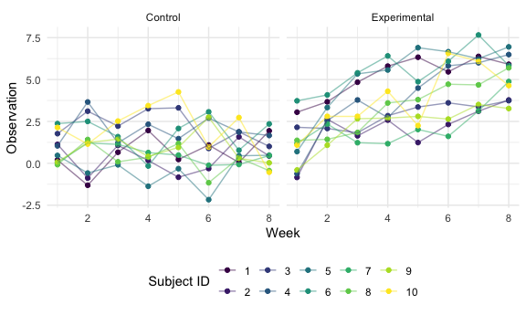
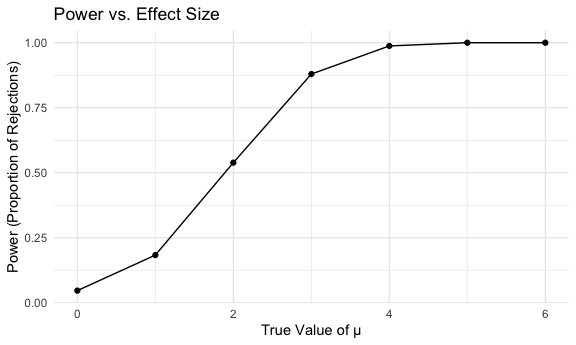
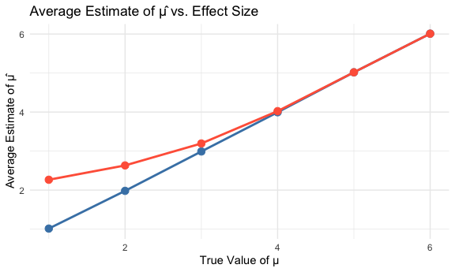

Homework 5
================
Kairui Wang
2023-11-05

Load key packages.

``` r
library(tidyverse)
library(rvest)
library(broom)
library(plotly)
library(dplyr)
```

Set seed for reproducibility.

``` r
set.seed(12345)
```

## Problem 1

Read the dataset from the corrected URL

``` r
data_url <- "https://raw.githubusercontent.com/washingtonpost/data-homicides/master/homicide-data.csv"
homicide_data <- read_csv(data_url)
```

    ## Rows: 52179 Columns: 12
    ## ── Column specification ────────────────────────────────────────────────────────
    ## Delimiter: ","
    ## chr (9): uid, victim_last, victim_first, victim_race, victim_age, victim_sex...
    ## dbl (3): reported_date, lat, lon
    ## 
    ## ℹ Use `spec()` to retrieve the full column specification for this data.
    ## ℹ Specify the column types or set `show_col_types = FALSE` to quiet this message.

Describe the raw data:

``` r
glimpse(homicide_data)
```

    ## Rows: 52,179
    ## Columns: 12
    ## $ uid           <chr> "Alb-000001", "Alb-000002", "Alb-000003", "Alb-000004", …
    ## $ reported_date <dbl> 20100504, 20100216, 20100601, 20100101, 20100102, 201001…
    ## $ victim_last   <chr> "GARCIA", "MONTOYA", "SATTERFIELD", "MENDIOLA", "MULA", …
    ## $ victim_first  <chr> "JUAN", "CAMERON", "VIVIANA", "CARLOS", "VIVIAN", "GERAL…
    ## $ victim_race   <chr> "Hispanic", "Hispanic", "White", "Hispanic", "White", "W…
    ## $ victim_age    <chr> "78", "17", "15", "32", "72", "91", "52", "52", "56", "4…
    ## $ victim_sex    <chr> "Male", "Male", "Female", "Male", "Female", "Female", "M…
    ## $ city          <chr> "Albuquerque", "Albuquerque", "Albuquerque", "Albuquerqu…
    ## $ state         <chr> "NM", "NM", "NM", "NM", "NM", "NM", "NM", "NM", "NM", "N…
    ## $ lat           <dbl> 35.09579, 35.05681, 35.08609, 35.07849, 35.13036, 35.151…
    ## $ lon           <dbl> -106.5386, -106.7153, -106.6956, -106.5561, -106.5810, -…
    ## $ disposition   <chr> "Closed without arrest", "Closed by arrest", "Closed wit…

``` r
head(homicide_data)
```

    ## # A tibble: 6 × 12
    ##   uid   reported_date victim_last victim_first victim_race victim_age victim_sex
    ##   <chr>         <dbl> <chr>       <chr>        <chr>       <chr>      <chr>     
    ## 1 Alb-…      20100504 GARCIA      JUAN         Hispanic    78         Male      
    ## 2 Alb-…      20100216 MONTOYA     CAMERON      Hispanic    17         Male      
    ## 3 Alb-…      20100601 SATTERFIELD VIVIANA      White       15         Female    
    ## 4 Alb-…      20100101 MENDIOLA    CARLOS       Hispanic    32         Male      
    ## 5 Alb-…      20100102 MULA        VIVIAN       White       72         Female    
    ## 6 Alb-…      20100126 BOOK        GERALDINE    White       91         Female    
    ## # ℹ 5 more variables: city <chr>, state <chr>, lat <dbl>, lon <dbl>,
    ## #   disposition <chr>

Create a city_state variable and summarize the data within cities

``` r
sum_homicide_data <- 
  homicide_data |> 
  mutate(city_state = paste(city, state, sep = ", ")) |> 
  group_by(city_state) |> 
  summarize(
    total_homicides = n(),
    unsolved_homicides = sum(disposition %in% c("Closed without arrest", "Open/No arrest"))
  ) |> 
  ungroup()

print(sum_homicide_data)
```

    ## # A tibble: 51 × 3
    ##    city_state      total_homicides unsolved_homicides
    ##    <chr>                     <int>              <int>
    ##  1 Albuquerque, NM             378                146
    ##  2 Atlanta, GA                 973                373
    ##  3 Baltimore, MD              2827               1825
    ##  4 Baton Rouge, LA             424                196
    ##  5 Birmingham, AL              800                347
    ##  6 Boston, MA                  614                310
    ##  7 Buffalo, NY                 521                319
    ##  8 Charlotte, NC               687                206
    ##  9 Chicago, IL                5535               4073
    ## 10 Cincinnati, OH              694                309
    ## # ℹ 41 more rows

Filter the data for Baltimore, MD

``` r
baltimore_data <- 
  homicide_data |> 
  filter(city == "Baltimore" & state == "MD")
```

Use prop.test to estimate the proportion of unsolved homicides

``` r
prop_test_result <- 
  prop.test(
  sum(baltimore_data$disposition %in% c("Closed without arrest", "Open/No arrest")),
  nrow(baltimore_data)
)
```

Apply broom::tidy to the prop.test result

``` r
baltimore_tidy <- 
  tidy(prop_test_result)
```

Extract the estimated proportion and confidence intervals

``` r
baltimore_proportion <- baltimore_tidy$p.value
baltimore_conf_interval <- prop_test_result$conf.int
```

Print the results

``` r
print(baltimore_tidy)
```

    ## # A tibble: 1 × 8
    ##   estimate statistic  p.value parameter conf.low conf.high method    alternative
    ##      <dbl>     <dbl>    <dbl>     <int>    <dbl>     <dbl> <chr>     <chr>      
    ## 1    0.646      239. 6.46e-54         1    0.628     0.663 1-sample… two.sided

Create a list column for each city and apply prop.test

``` r
result_df <- 
  homicide_data |> 
  group_by(city) |> 
  nest() |> 
  mutate(
    prop_test_result = map(data, ~ prop.test(
      sum(.x$disposition %in% c("Closed without arrest", "Open/No arrest")),
      nrow(.x)
    )),
    tidy_results = map(prop_test_result, broom::tidy)
  ) |> 
  unnest(tidy_results) |> 
  select(city, estimate, conf.low, conf.high)

print(result_df)
```

    ## # A tibble: 50 × 4
    ## # Groups:   city [50]
    ##    city        estimate conf.low conf.high
    ##    <chr>          <dbl>    <dbl>     <dbl>
    ##  1 Albuquerque    0.386    0.337     0.438
    ##  2 Atlanta        0.383    0.353     0.415
    ##  3 Baltimore      0.646    0.628     0.663
    ##  4 Baton Rouge    0.462    0.414     0.511
    ##  5 Birmingham     0.434    0.399     0.469
    ##  6 Boston         0.505    0.465     0.545
    ##  7 Buffalo        0.612    0.569     0.654
    ##  8 Charlotte      0.300    0.266     0.336
    ##  9 Chicago        0.736    0.724     0.747
    ## 10 Cincinnati     0.445    0.408     0.483
    ## # ℹ 40 more rows

Create a plot

``` r
result_df |> 
  mutate(city = fct_reorder(city, estimate)) |> 
  ggplot(aes(x = estimate, y = city)) +
  geom_point(size = 3) +
  geom_errorbarh(aes(xmin = conf.low, xmax = conf.high), height = 0.2) +
  labs(
    x = "Proportion of Unsolved Homicides",
    y = "City",
    title = "Proportion of Unsolved Homicides by City",
    subtitle = "Estimates and Confidence Intervals"
  ) +
   theme_minimal()
```


## Problem 2

List all files in the extracted folder

``` r
file_names <- list.files(path = "data", pattern = ".csv", full.names = TRUE)
```

Read in data for each subject using purrr::map

``` r
data_list <- map(file_names, ~ read_csv(.x) %>% mutate(file_id = basename(.x)))
```

    ## Rows: 1 Columns: 8
    ## ── Column specification ────────────────────────────────────────────────────────
    ## Delimiter: ","
    ## dbl (8): week_1, week_2, week_3, week_4, week_5, week_6, week_7, week_8
    ## 
    ## ℹ Use `spec()` to retrieve the full column specification for this data.
    ## ℹ Specify the column types or set `show_col_types = FALSE` to quiet this message.
    ## Rows: 1 Columns: 8
    ## ── Column specification ────────────────────────────────────────────────────────
    ## Delimiter: ","
    ## dbl (8): week_1, week_2, week_3, week_4, week_5, week_6, week_7, week_8
    ## 
    ## ℹ Use `spec()` to retrieve the full column specification for this data.
    ## ℹ Specify the column types or set `show_col_types = FALSE` to quiet this message.
    ## Rows: 1 Columns: 8
    ## ── Column specification ────────────────────────────────────────────────────────
    ## Delimiter: ","
    ## dbl (8): week_1, week_2, week_3, week_4, week_5, week_6, week_7, week_8
    ## 
    ## ℹ Use `spec()` to retrieve the full column specification for this data.
    ## ℹ Specify the column types or set `show_col_types = FALSE` to quiet this message.
    ## Rows: 1 Columns: 8
    ## ── Column specification ────────────────────────────────────────────────────────
    ## Delimiter: ","
    ## dbl (8): week_1, week_2, week_3, week_4, week_5, week_6, week_7, week_8
    ## 
    ## ℹ Use `spec()` to retrieve the full column specification for this data.
    ## ℹ Specify the column types or set `show_col_types = FALSE` to quiet this message.
    ## Rows: 1 Columns: 8
    ## ── Column specification ────────────────────────────────────────────────────────
    ## Delimiter: ","
    ## dbl (8): week_1, week_2, week_3, week_4, week_5, week_6, week_7, week_8
    ## 
    ## ℹ Use `spec()` to retrieve the full column specification for this data.
    ## ℹ Specify the column types or set `show_col_types = FALSE` to quiet this message.
    ## Rows: 1 Columns: 8
    ## ── Column specification ────────────────────────────────────────────────────────
    ## Delimiter: ","
    ## dbl (8): week_1, week_2, week_3, week_4, week_5, week_6, week_7, week_8
    ## 
    ## ℹ Use `spec()` to retrieve the full column specification for this data.
    ## ℹ Specify the column types or set `show_col_types = FALSE` to quiet this message.
    ## Rows: 1 Columns: 8
    ## ── Column specification ────────────────────────────────────────────────────────
    ## Delimiter: ","
    ## dbl (8): week_1, week_2, week_3, week_4, week_5, week_6, week_7, week_8
    ## 
    ## ℹ Use `spec()` to retrieve the full column specification for this data.
    ## ℹ Specify the column types or set `show_col_types = FALSE` to quiet this message.
    ## Rows: 1 Columns: 8
    ## ── Column specification ────────────────────────────────────────────────────────
    ## Delimiter: ","
    ## dbl (8): week_1, week_2, week_3, week_4, week_5, week_6, week_7, week_8
    ## 
    ## ℹ Use `spec()` to retrieve the full column specification for this data.
    ## ℹ Specify the column types or set `show_col_types = FALSE` to quiet this message.
    ## Rows: 1 Columns: 8
    ## ── Column specification ────────────────────────────────────────────────────────
    ## Delimiter: ","
    ## dbl (8): week_1, week_2, week_3, week_4, week_5, week_6, week_7, week_8
    ## 
    ## ℹ Use `spec()` to retrieve the full column specification for this data.
    ## ℹ Specify the column types or set `show_col_types = FALSE` to quiet this message.
    ## Rows: 1 Columns: 8
    ## ── Column specification ────────────────────────────────────────────────────────
    ## Delimiter: ","
    ## dbl (8): week_1, week_2, week_3, week_4, week_5, week_6, week_7, week_8
    ## 
    ## ℹ Use `spec()` to retrieve the full column specification for this data.
    ## ℹ Specify the column types or set `show_col_types = FALSE` to quiet this message.
    ## Rows: 1 Columns: 8
    ## ── Column specification ────────────────────────────────────────────────────────
    ## Delimiter: ","
    ## dbl (8): week_1, week_2, week_3, week_4, week_5, week_6, week_7, week_8
    ## 
    ## ℹ Use `spec()` to retrieve the full column specification for this data.
    ## ℹ Specify the column types or set `show_col_types = FALSE` to quiet this message.
    ## Rows: 1 Columns: 8
    ## ── Column specification ────────────────────────────────────────────────────────
    ## Delimiter: ","
    ## dbl (8): week_1, week_2, week_3, week_4, week_5, week_6, week_7, week_8
    ## 
    ## ℹ Use `spec()` to retrieve the full column specification for this data.
    ## ℹ Specify the column types or set `show_col_types = FALSE` to quiet this message.
    ## Rows: 1 Columns: 8
    ## ── Column specification ────────────────────────────────────────────────────────
    ## Delimiter: ","
    ## dbl (8): week_1, week_2, week_3, week_4, week_5, week_6, week_7, week_8
    ## 
    ## ℹ Use `spec()` to retrieve the full column specification for this data.
    ## ℹ Specify the column types or set `show_col_types = FALSE` to quiet this message.
    ## Rows: 1 Columns: 8
    ## ── Column specification ────────────────────────────────────────────────────────
    ## Delimiter: ","
    ## dbl (8): week_1, week_2, week_3, week_4, week_5, week_6, week_7, week_8
    ## 
    ## ℹ Use `spec()` to retrieve the full column specification for this data.
    ## ℹ Specify the column types or set `show_col_types = FALSE` to quiet this message.
    ## Rows: 1 Columns: 8
    ## ── Column specification ────────────────────────────────────────────────────────
    ## Delimiter: ","
    ## dbl (8): week_1, week_2, week_3, week_4, week_5, week_6, week_7, week_8
    ## 
    ## ℹ Use `spec()` to retrieve the full column specification for this data.
    ## ℹ Specify the column types or set `show_col_types = FALSE` to quiet this message.
    ## Rows: 1 Columns: 8
    ## ── Column specification ────────────────────────────────────────────────────────
    ## Delimiter: ","
    ## dbl (8): week_1, week_2, week_3, week_4, week_5, week_6, week_7, week_8
    ## 
    ## ℹ Use `spec()` to retrieve the full column specification for this data.
    ## ℹ Specify the column types or set `show_col_types = FALSE` to quiet this message.
    ## Rows: 1 Columns: 8
    ## ── Column specification ────────────────────────────────────────────────────────
    ## Delimiter: ","
    ## dbl (8): week_1, week_2, week_3, week_4, week_5, week_6, week_7, week_8
    ## 
    ## ℹ Use `spec()` to retrieve the full column specification for this data.
    ## ℹ Specify the column types or set `show_col_types = FALSE` to quiet this message.
    ## Rows: 1 Columns: 8
    ## ── Column specification ────────────────────────────────────────────────────────
    ## Delimiter: ","
    ## dbl (8): week_1, week_2, week_3, week_4, week_5, week_6, week_7, week_8
    ## 
    ## ℹ Use `spec()` to retrieve the full column specification for this data.
    ## ℹ Specify the column types or set `show_col_types = FALSE` to quiet this message.
    ## Rows: 1 Columns: 8
    ## ── Column specification ────────────────────────────────────────────────────────
    ## Delimiter: ","
    ## dbl (8): week_1, week_2, week_3, week_4, week_5, week_6, week_7, week_8
    ## 
    ## ℹ Use `spec()` to retrieve the full column specification for this data.
    ## ℹ Specify the column types or set `show_col_types = FALSE` to quiet this message.
    ## Rows: 1 Columns: 8
    ## ── Column specification ────────────────────────────────────────────────────────
    ## Delimiter: ","
    ## dbl (8): week_1, week_2, week_3, week_4, week_5, week_6, week_7, week_8
    ## 
    ## ℹ Use `spec()` to retrieve the full column specification for this data.
    ## ℹ Specify the column types or set `show_col_types = FALSE` to quiet this message.

Tidy the result

``` r
tidy_data <- bind_rows(data_list) %>%
  separate(file_id, into = c("arm", "subject_id"), sep = "_") %>%
  mutate(group = ifelse(grepl("con", file_names), "Control", "Experimental")) %>%
  mutate(subject_ID = as.integer(str_extract(file_names, "[0-9][0-9]"))) %>%
  pivot_longer(
    cols = starts_with("week"),
    names_to = "week",
    values_to = "observation"
  ) %>%
  mutate(week = as.numeric(gsub("week_", "", week)))
```

Create a spaghetti plot

``` r
tidy_data %>% 
  ggplot(aes(x = week, y =observation, color = as.factor(subject_ID))) +
  geom_point() +
  geom_line(aes(group = subject_ID), alpha=0.5) +
  facet_grid(~group) +
  labs(x = "Week", y = "Observation", col = "Subject ID")
```



## Problem 3

Set design elements

``` r
n <- 30
sigma <- 5
alpha <- 0.05
true_values <- 0:6
num_simulations <- 5000
```

Initialize data frames to store results

``` r
power_results <- data.frame(mu = true_values, power = numeric(length(true_values)))
average_estimate_results <- data.frame(mu = true_values, 
                                       avg_estimate = numeric(length(true_values)),
                                       avg_estimate_rejected = numeric(length(true_values)))
```

Perform simulations for different values of μ

``` r
for (mu in true_values) {
  rejected_count <- 0
  total_estimate <- 0
  total_estimate_rejected <- 0
  
  for (i in 1:num_simulations) {
    # Generate a random sample from Normal distribution
    sample_data <- rnorm(n, mean = mu, sd = sigma)
    
    # Perform one-sample t-test
    t_test_result <- t.test(sample_data, mu = 0)
    
    # Use broom::tidy to clean the t.test result
    tidy_result <- tidy(t_test_result)
    
    # Save the estimate and p-value
    estimate <- tidy_result$estimate
    p_value <- tidy_result$p.value
    
    # Check if null hypothesis is rejected
    if (p_value < alpha) {
      rejected_count <- rejected_count + 1
      total_estimate_rejected <- total_estimate_rejected + estimate
    }
    
    total_estimate <- total_estimate + estimate
  }
  
  # Calculate power
  power <- rejected_count / num_simulations
  
  # Calculate average estimate
  avg_estimate <- total_estimate / num_simulations
  
  # Calculate average estimate for rejected cases
  avg_estimate_rejected <- total_estimate_rejected / rejected_count
  
  # Store results in data frames
  power_results$power[power_results$mu == mu] <- power
  average_estimate_results$avg_estimate[average_estimate_results$mu == mu] <- avg_estimate
  average_estimate_results$avg_estimate_rejected[average_estimate_results$mu == mu] <- avg_estimate_rejected
}
```

Plot the proportion of times the null was rejected (power)

``` r
ggplot(power_results, aes(x = mu, y = power)) +
  geom_point() +
  geom_line() + 
  labs(
    x = "True Value of μ",
    y = "Power (Proportion of Rejections)",
    title = "Power vs. Effect Size"
  )
```



Plot the average estimate of μ̂

``` r
ggplot(average_estimate_results, aes(x = mu, y = avg_estimate, group = 1)) +
  geom_point(aes(color = "steelblue"), size = 3) +
  geom_line(aes(y = avg_estimate, color = "steelblue"), size = 1) +
  geom_point(data = average_estimate_results, aes(x = mu, y = avg_estimate_rejected, color = "tomato"), size = 3) +
  geom_line(data = average_estimate_results, aes(x = mu, y = avg_estimate_rejected, color = "tomato"), size = 1) +
  labs(
    x = "True Value of μ",
    y = "Average Estimate of μ̂",
    title = "Average Estimate of μ̂ vs. Effect Size"
  ) +
  scale_color_identity() +
  scale_x_continuous(limits = c(1, max(average_estimate_results$mu))) +
  scale_y_continuous(limits = c(1, max(average_estimate_results$avg_estimate, average_estimate_results$avg_estimate_rejected)))
```


